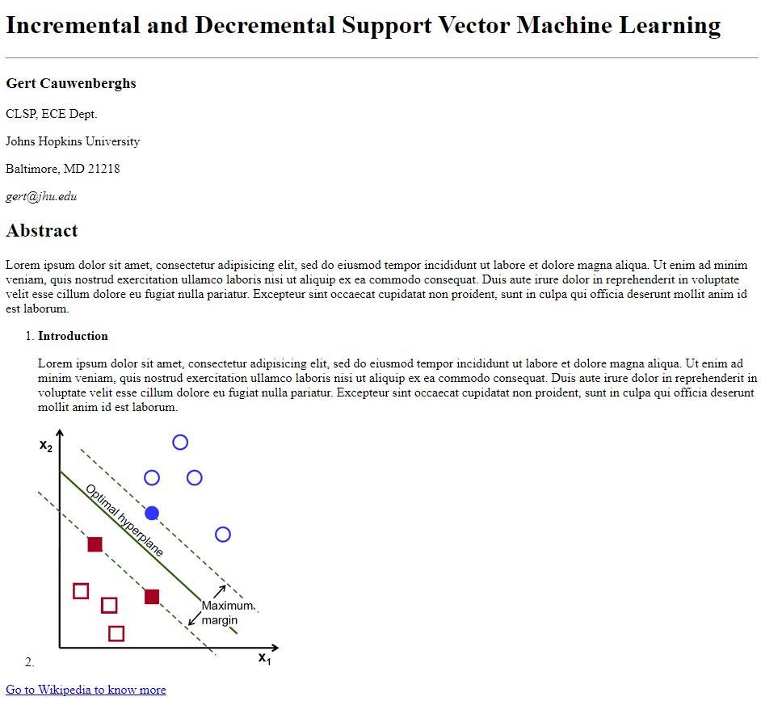

# HTML Scientific Paper
Welcome to the first exercise of the HTML series. In this exercise we are going to use the HTML elements you've learned about this morning to replicate the below web page:



## Instructions
- Start with the template in `index.html`
- Add a `<title>` in the `<head>` of the HTML page
- Use HTML elements like `<header>` and `<section>` to structure your code
- Use HTML elements like `<h1>` and `<em>` to format the text
- Use HTML elements like `` and `<a>` with the correct attributes

## Tips
* Use indentation and nesting to organise your code and improve readability.

```
<section>
	<p>This paragraph is indented and nested inside the section element.</p>
</section>
```

## Resources
- Use this website to generate text: [https://www.lipsum.com/]
- Use this url for the image: [https://docs.opencv.org/2.4/_images/optimal-hyperplane.png]
- Use this url for the link: [https://en.wikipedia.org/wiki/Support_vector_machine]

## Challenges
- Create a second page and link to it
- Use five elements not listed above! Use the MDN resource above to find new elements you've not yet used.